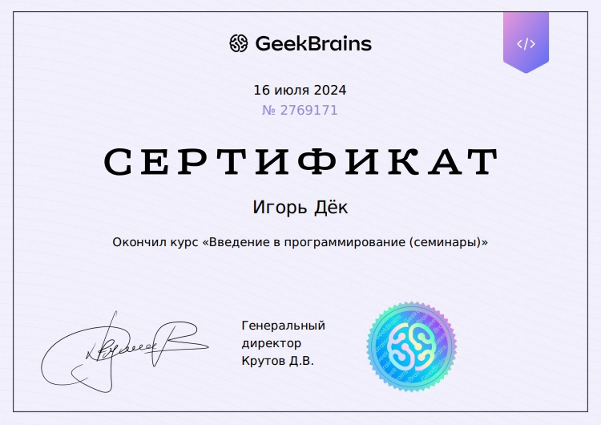

# Markdown символы
## Второй заголовок
### Третий заголовок
#### Всего шесть уровней (это четвёртый)

1. **Хочу быть жирным**
2. *Курсив*
3. ***Полужирный курсив***
4. ~~Зачёркнутый текст~~ "~~ такими знаками ~~"
5. 
* Ненумерованный список
* Хлеб
* Морковь
* Колбаса

6. > Этот символ ">" выделяет текст блоком, как 
   цитату. Очень удобно выделять главное в тексте!

